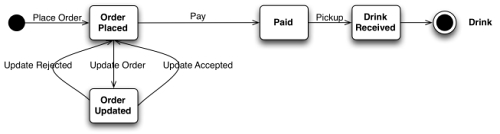
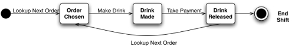

StarBux Microservices
=====================

Studying microservices as described in [this InfoQ article].

[this InfoQ article]: https://www.infoq.com/articles/webber-rest-workflow

Workflows
---------
There is an interaction between the customer and the Starbucks service, where customers advance
towards the goal of drinking some coffee by interacting with the Starbucks service. As part of the
workflow, we assume that the customer places an order, pays, and then waits for their drink.
Between placing and paying for the order, the customer can usually amend it – by, for example,
asking for semi-skimmed milk to be used.

A second workflow captures the set of actions performed by a barista, which has his own state
machine, though it's not visible to the customer. As shown in the figure below, the barista loops
around looking for the next order to be made, preparing the drink, and taking the payment.
An instance of the loop can begin when an order is added to the barista's queue. The outputs of the
workflow are available to the customer when the barista finishes the order and releases the drink.

